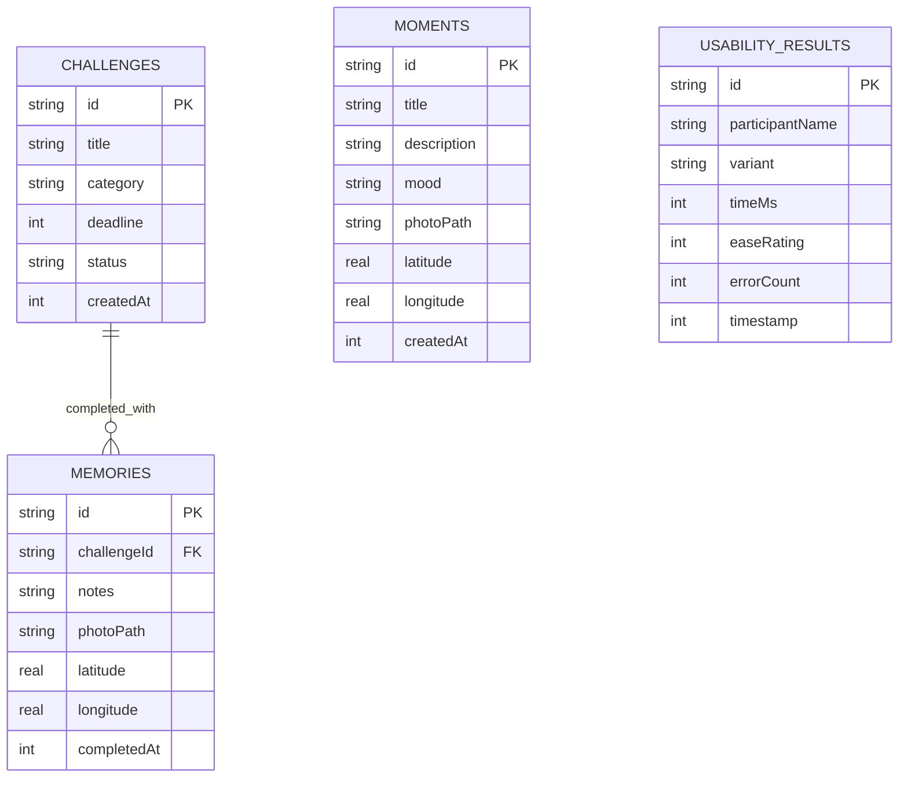
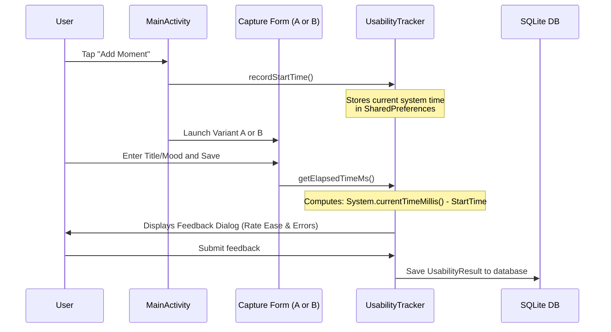

# MomentQuest: Technical Architecture & Code Explanation Guide

This guide is designed to help you explain the technical implementation and design patterns of **MomentQuest** during your presentation. It covers how the core features are built, how they connect together, and how the underlying Android APIs are utilized.

---

## Table of Contents
1. [Database Connectivity & Architecture](#1-database-connectivity--architecture)
2. [CRUD Operations (Data Access Layer)](#2-crud-operations-data-access-layer)
3. [Bottom Sheet Dialog Implementation](#3-bottom-sheet-dialog-implementation)
4. [Floating Action Button (FAB) & Speed Dial](#4-floating-action-button-fab--speed-dial)
5. [Reverse Geocoding & Address Resolution](#5-reverse-geocoding--address-resolution)
6. [Statistics & Completion Computations](#6-statistics--completion-computations)
7. [Unified Timeline Feed & Sealed Classes](#7-unified-timeline-feed--sealed-classes)
8. [A/B Usability Testing & Analytics Engine](#8-ab-usability-testing--analytics-engine)

---

## 1. Database Connectivity & Architecture

MomentQuest utilizes a local SQLite database to persist user data (challenges, moments, memories, and usability results). In Android, SQLite is embedded directly into the operating system, meaning no external server or setup is required.

### Connection and Schema Setup
The connection is established using a helper class, [DatabaseHelper.kt](file:///Users/showwaiyan/AndroidStudioProjects/MomentQuest/app/src/main/java/com/example/momentquest/repository/DatabaseHelper.kt), which extends `SQLiteOpenHelper`.

*   **Helper Initialization:** `SQLiteOpenHelper` handles creating and upgrading the database file (`momentquest.db`) automatically based on its version.
*   **Active Table Schema:**
    *   `TABLE_CHALLENGES`: Stores goals (ID, title, category, status, deadline, timestamp).
    *   `TABLE_MOMENTS`: Stores photo/text logs (ID, title, description, mood, local photo path, latitude, longitude, timestamp).
    *   `TABLE_MEMORIES`: Connects completed challenges to photos/notes (ID, challengeId (Foreign Key), notes, photoPath, latitude, longitude, completed timestamp).
    *   `TABLE_USABILITY_RESULTS`: Stores stopwatch and feedback metrics from usability testing (ID, participant, variant, elapsed time, rating, error count, timestamp).



### Thread Safety & Coroutines
To prevent freezing the User Interface (UI), all database reads and writes are executed asynchronously off the Main thread using **Kotlin Coroutines** with `Dispatchers.IO` (Input/Output thread pool). 
For example:
```kotlin
suspend fun addMoment(context: Context, moment: Moment): Unit = withContext(Dispatchers.IO) {
    val dbHelper = DatabaseHelper(context)
    val db = dbHelper.writableDatabase
    // Operations...
    db.close()
}
```

---

## 2. CRUD Operations (Data Access Layer)

CRUD (Create, Read, Update, Delete) is encapsulated in repository classes ([MomentRepository.kt](file:///Users/showwaiyan/AndroidStudioProjects/MomentQuest/app/src/main/java/com/example/momentquest/repository/MomentRepository.kt), [ChallengeRepository.kt](file:///Users/showwaiyan/AndroidStudioProjects/MomentQuest/app/src/main/java/com/example/momentquest/repository/ChallengeRepository.kt), and [UsabilityRepository.kt](file:///Users/showwaiyan/AndroidStudioProjects/MomentQuest/app/src/main/java/com/example/momentquest/repository/UsabilityRepository.kt)).

Here is how each operation is structurally written using SQLite Android APIs:

### C - Create (Insert)
Inserts use `ContentValues` (a key-value map mapping column names to values) and the `db.insert()` method. This design shields the app from SQL injection attacks.
```kotlin
val values = ContentValues().apply {
    put(DatabaseHelper.COLUMN_ID, id)
    put(DatabaseHelper.COLUMN_MOMENT_TITLE, moment.title)
    put(DatabaseHelper.COLUMN_MOMENT_DESCRIPTION, moment.description)
    // ...
}
db.insert(DatabaseHelper.TABLE_MOMENTS, null, values)
```

### R - Read (Query)
Queries use the built-in query builder `db.query()`, which yields a `Cursor`. We iterate over the cursor using a while loop and extract the fields safely:
```kotlin
val cursor = db.query(DatabaseHelper.TABLE_MOMENTS, null, null, null, null, null, "$COLUMN_MOMENT_CREATED_AT DESC")
while (cursor.moveToNext()) {
    val moment = Moment(
        id = cursor.getString(cursor.getColumnIndexOrThrow(DatabaseHelper.COLUMN_ID)),
        title = cursor.getString(cursor.getColumnIndexOrThrow(DatabaseHelper.COLUMN_MOMENT_TITLE)),
        // ...
    )
    list.add(moment)
}
cursor.close()
```

### U - Update
Updates use `ContentValues` combined with parameterized where clauses (`?`) to specify which row is modified.
```kotlin
db.update(
    DatabaseHelper.TABLE_MOMENTS,
    values,
    "${DatabaseHelper.COLUMN_ID} = ?",
    arrayOf(moment.id)
)
```

### D - Delete
Deletes call `db.delete()`. In the [MomentRepository.kt](file:///Users/showwaiyan/AndroidStudioProjects/MomentQuest/app/src/main/java/com/example/momentquest/repository/MomentRepository.kt) implementation, the deletion is double-actioned; it queries the local photo file path first, deletes the image file from internal application storage, and then deletes the database row to prevent orphaned image files.
```kotlin
db.delete(
    DatabaseHelper.TABLE_MOMENTS,
    "${DatabaseHelper.COLUMN_ID} = ?",
    arrayOf(momentId)
)
```

---

## 3. Bottom Sheet Dialog Implementation

The "Add Moment" form is implemented as a **Bottom Sheet Dialog**, which slides smoothly up from the screen bottom. This provides a lightweight context switch for the user instead of launching a full-screen Activity.

### Core Class
The bottom sheet is defined in [AddMomentBottomSheet.kt](file:///Users/showwaiyan/AndroidStudioProjects/MomentQuest/app/src/main/java/com/example/momentquest/ui/fragment/AddMomentBottomSheet.kt) and inherits from `BottomSheetDialogFragment` (from Google's Material Components library).

### Launching the Bottom Sheet
It is launched dynamically from [MainActivity.kt](file:///Users/showwaiyan/AndroidStudioProjects/MomentQuest/app/src/main/java/com/example/momentquest/MainActivity.kt) as follows:
```kotlin
val bottomSheet = AddMomentBottomSheet.newInstance {
    // Refresh the feed on success
    currentFragment.onResume()
}
bottomSheet.show(supportFragmentManager, "AddMomentBottomSheet")
```

### Flow and Component Integration inside the Bottom Sheet
1.  **View Binding:** Binds `bottom_sheet_add_moment.xml` variables in `onCreateView` to avoid raw `findViewById` calls.
2.  **GPS Fetching:** Instantly requests location permissions. On permission grant, it queries `LocationServices.getFusedLocationProviderClient` to display decimal coordinates.
3.  **Media Capture:** Opens the camera via `registerForActivityResult(ActivityResultContracts.TakePicture())` or gallery picker via `GetContent()`.
4.  **Save & Callback:** Triggers the [MomentViewModel.kt](file:///Users/showwaiyan/AndroidStudioProjects/MomentQuest/app/src/main/java/com/example/momentquest/viewmodel/MomentViewModel.kt) to insert the moment. Once the ViewModel updates a `saveSuccess` LiveData variable, the bottom sheet triggers `onSuccessCallback?.invoke()` and dismisses itself.

---

## 4. Floating Action Button (FAB) & Speed Dial

To keep the UI clean, a single Floating Action Button (`fabAdd`) is used as a nested **Speed Dial Menu**. It gives access to creating both Challenges and Moments.

### Layout Concept
In `activity_main.xml`, the FAB and its sub-buttons are arranged inside a `CoordinatorLayout`:
-   `fabAdd`: Main floating circular button.
-   `speedDialContainer`: A vertical `LinearLayout` containing two smaller FAB-style text-button pairs (`btnActionChallenge` and `btnActionMoment`) placed directly above the main FAB. This container is set to `android:visibility="gone"` by default.

### Animation and Toggle Logic
When the user clicks `fabAdd`, the code in [MainActivity.kt](file:///Users/showwaiyan/AndroidStudioProjects/MomentQuest/app/src/main/java/com/example/momentquest/MainActivity.kt#L214-L222) toggles the container visibility and rotates/switches the main icon:
```kotlin
private fun toggleSpeedDial() {
    if (binding.speedDialContainer.visibility == View.VISIBLE) {
        binding.speedDialContainer.visibility = View.GONE
        binding.fabAdd.setImageResource(R.drawable.ic_add) // Displays "+" icon
    } else {
        binding.speedDialContainer.visibility = View.VISIBLE
        binding.fabAdd.setImageResource(R.drawable.ic_close) // Displays "x" icon
    }
}
```

### Dynamic Redirection (A/B Test Variant routing)
When the user taps the **Add Moment** sub-action inside the speed dial, the FAB click-handler queries the A/B testing settings to route the user:
```kotlin
val variant = UsabilityTracker.getSelectedVariant(this)
if (variant == "A") {
    // Variant A: Launch full screen capture activity
    val intent = Intent(this, AddMomentActivity::class.java)
    startActivity(intent)
} else {
    // Variant B: Launch bottom sheet dialog
    val bottomSheet = AddMomentBottomSheet.newInstance { ... }
    bottomSheet.show(supportFragmentManager, "AddMomentBottomSheet")
}
```

---

## 5. Reverse Geocoding & Address Resolution

When logging a Moment, the device records raw GPS coordinates (Latitude & Longitude). To show the user a human-readable address, the application uses **Reverse Geocoding**.

### API Architecture
The geocoding logic is isolated inside [GeocoderHelper.kt](file:///Users/showwaiyan/AndroidStudioProjects/MomentQuest/app/src/main/java/com/example/momentquest/util/GeocoderHelper.kt). It uses Android's native `Geocoder` class.

1.  **Asynchronous Call:** Since resolving coordinates requires a network request to Google Maps servers (which can hang or block), it is launched on `Dispatchers.IO`.
2.  **Address Parsing:** We request only `1` address result. If found, we extract the structural address parameters:
    *   `locality` (City name)
    *   `adminArea` (State/Region)
    *   `countryName` (Country)
    *   `getAddressLine(0)` (Full street address)
3.  **In-Memory Caching:** To avoid redundant network calls and conserve battery/api requests, resolved coordinates are cached in a `ConcurrentHashMap`:
    ```kotlin
    private val addressCache = ConcurrentHashMap<Pair<Double, Double>, Address>()
    ```
    Before executing the geocoder network request, the helper looks up the coordinate pair. If cached, it returns the stored `Address` object instantly.

```kotlin
suspend fun getAddressFromLocation(context: Context, latitude: Double, longitude: Double): Address? {
    val cacheKey = Pair(latitude, longitude)
    addressCache[cacheKey]?.let { return it } // Cache Hit

    return withContext(Dispatchers.IO) {
        try {
            val geocoder = Geocoder(context, Locale.getDefault())
            val addresses = geocoder.getFromLocation(latitude, longitude, 1)
            val address = addresses?.firstOrNull()
            if (address != null) {
                addressCache[cacheKey] = address // Cache Write
            }
            address
        } catch (e: Exception) {
            null
        }
    }
}
```

---

## 6. Statistics & Completion Computations

The stats dashboard compiles metrics regarding the user's progress. This computation is carried out in [StatsViewModel.kt](file:///Users/showwaiyan/AndroidStudioProjects/MomentQuest/app/src/main/java/com/example/momentquest/viewmodel/StatsViewModel.kt).

### Compilation Pipeline
The logic utilizes standard Kotlin collections operators:

1.  **Total Challenges:** `challenges.size`
2.  **Completed Challenges:** Computed by counting items with the status matching `"COMPLETED"`:
    ```kotlin
    val completedCount = challenges.count { it.status == "COMPLETED" }
    ```
3.  **Total Completion Rate:** Computed as a whole-number percentage. A fallback is implemented to avoid crashes (Division by Zero) if there are no challenges:
    ```kotlin
    val rate = if (totalCount > 0) (completedCount * 100) / totalCount else 0
    ```
4.  **Category Breakdowns:** The application lists progress stats for individual categories: `Travel`, `Learning`, `Fitness`, `Social`, `Career`, and `Others`. The list is processed in a loop:
    ```kotlin
    val breakdown = mutableMapOf<String, Pair<Int, Int>>()
    val categories = listOf("Travel", "Learning", "Fitness", "Social", "Career", "Others")
    for (cat in categories) {
        val catChallenges = challenges.filter { it.category.equals(cat, ignoreCase = true) }
        val catTotal = catChallenges.size
        val catCompleted = catChallenges.count { it.status == "COMPLETED" }
        breakdown[cat] = Pair(catCompleted, catTotal) // e.g. "Travel" -> (3 completed, 5 total)
    }
    ```

Once calculated, the values are posted to `LiveData` fields. The [StatsFragment.kt](file:///Users/showwaiyan/AndroidStudioProjects/MomentQuest/app/src/main/java/com/example/momentquest/ui/fragment/StatsFragment.kt) observes these LiveData objects and dynamically updates the visual progress bars (`ProgressBar`) and text descriptions on the screen.

---

## 7. Unified Timeline Feed & Sealed Classes

The home screen displays a single, integrated feed containing both Challenges (Goals) and Moments (Daily Check-ins), ordered chronologically.

### Kotlin Sealed Classes
To merge different data models into one RecyclerView, the project defines [TimelineItem.kt](file:///Users/showwaiyan/AndroidStudioProjects/MomentQuest/app/src/main/java/com/example/momentquest/model/TimelineItem.kt) as a sealed class:
```kotlin
sealed class TimelineItem {
    abstract val itemId: String
    abstract val timestamp: Long

    data class ChallengeItem(val challenge: Challenge) : TimelineItem() {
        override val itemId: String get() = challenge.id
        override val timestamp: Long get() = challenge.createdAt
    }

    data class MomentItem(val moment: Moment) : TimelineItem() {
        override val itemId: String get() = moment.id
        override val timestamp: Long get() = moment.createdAt
    }
}
```

### Merging and Sorting
In [TimelineViewModel.kt](file:///Users/showwaiyan/AndroidStudioProjects/MomentQuest/app/src/main/java/com/example/momentquest/viewmodel/TimelineViewModel.kt#L62-L64), lists of Challenges and Moments are converted into `TimelineItem` wrappers, merged with the `+` operator, and sorted in descending order:
```kotlin
val merged = (challengeItems + momentItems).sortedByDescending { it.timestamp }
```

---

## 8. A/B Usability Testing & Analytics Engine

One of the advanced parts of the codebase is the A/B testing infrastructure. It measures whether users can record daily moments faster using a **Full-Screen Activity (Variant A)** or a **Bottom Sheet Dialog (Variant B)**.

### Analytics Pipeline Flow


### Dynamic Decision Recommendation
When you open the Usability Dashboard ([UsabilityDashboardBottomSheet.kt](file:///Users/showwaiyan/AndroidStudioProjects/MomentQuest/app/src/main/java/com/example/momentquest/ui/fragment/UsabilityDashboardBottomSheet.kt)), the app queries all test runs from the database, separates them by variant, and calculates the averages:
-   Average completion speed (seconds).
-   Average user-reported ease rating (1-5 scale).
-   Total errors encountered.

The dashboard then performs a programmatic comparison to show a dynamic recommendation:
```kotlin
if (avgTimeA != null && avgTimeB != null && avgEaseA != null && avgEaseB != null) {
    val speedDiffPercent = ((avgTimeA - avgTimeB) / avgTimeA) * 100
    val easeDiff = avgEaseB - avgEaseA

    if (avgTimeB < avgTimeA) {
        binding.tvRecommendation.text = String.format(
            "Recommendation: Variant B (Bottom Sheet) is %.1f%% faster and rated %.1f points higher. Adopt Variant B!",
            speedDiffPercent, easeDiff
        )
    } else {
        binding.tvRecommendation.text = String.format(
            "Recommendation: Variant A (Full Screen) is %.1f%% faster and rated %.1f points higher. Adopt Variant A!",
            -speedDiffPercent, -easeDiff
        )
    }
}
```
This is a real-world example of **Data-Driven UX Design**, where the software itself determines and recommends the best layout variant based on user testing data!
